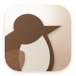

# DipperPDF

DipperPDF is a native, offline macOS app for everyday PDF work. Your documents stay on your Mac, and each tool saves a separate output file so your originals remain unchanged.

It is built with Swift 6, SwiftUI, AppKit, PDFKit, and Quartz. DipperPDF requires **macOS 14 or later**, works on Apple silicon and Intel Macs, and has no accounts, subscriptions, analytics, or external PDF services.

## Tools

- **Compress PDF**
- **Merge PDFs**
- **Rotate PDF**
- **Remove Pages**
- **Extract Pages**
- **Split PDF**
- **Add Page Numbers**
- **Reverse Pages**
- **Edit PDF Metadata**
- **Extract Text**
- **Add Watermark**
- **Crop PDF**
- **Remove Annotations**
- **Unlock PDF**

## Get DipperPDF

Download the latest disk image from [GitHub Releases](https://github.com/nshntarora/dipperpdf/releases/latest/download/DipperPDF.dmg). Open the DMG, drag **DipperPDF** into Applications, then open it from Applications.

For current release notes and signing information, see the [release list](https://github.com/nshntarora/dipperpdf/releases).

## Project guide

This repository contains two independently deployable projects:

- [macOS app](macos/README.md) — build, run, test, extend, package, and distribute DipperPDF.
- [Website](website/README.md) — develop and deploy the static product and documentation site.

The detailed technical instructions belong in those READMEs. Run native app commands from `macos/`; run pnpm commands from the repository root.

## Meet the dipper

The app's brown-and-white bird artwork takes its cue from the dipper. These little songbirds hunt underwater in fast-flowing streams for insect larvae and freshwater shrimps. Their name comes from the bobbing, or “dipping,” motion they make on land. The white-throated dipper sports a bright white throat and chest against its dark plumage—the same distinctive bib you'll see in the app's logo. Learn more from the [RSPB's dipper guide](https://www.rspb.org.uk/birds-and-wildlife/dipper).
